# Electrician Log MVP — Architecture Reference

**Audience:** Architecture Engineer Review
**Date:** 2026-04-14
**Stack:** Flask + Flask-Sock (Python) · Vue 3 + OpenSeadragon (JS) · SQLite · IndexedDB

This document presents the architecture as a series of Mermaid diagrams, organized from high-level context down to specific subsystem flows. Each diagram is self-contained and can be rendered in any Mermaid-compatible viewer (GitHub, VS Code, mermaid.live).

---

## 1. System Context (C4 Level 1)

High-level view of actors, the system, and external dependencies.

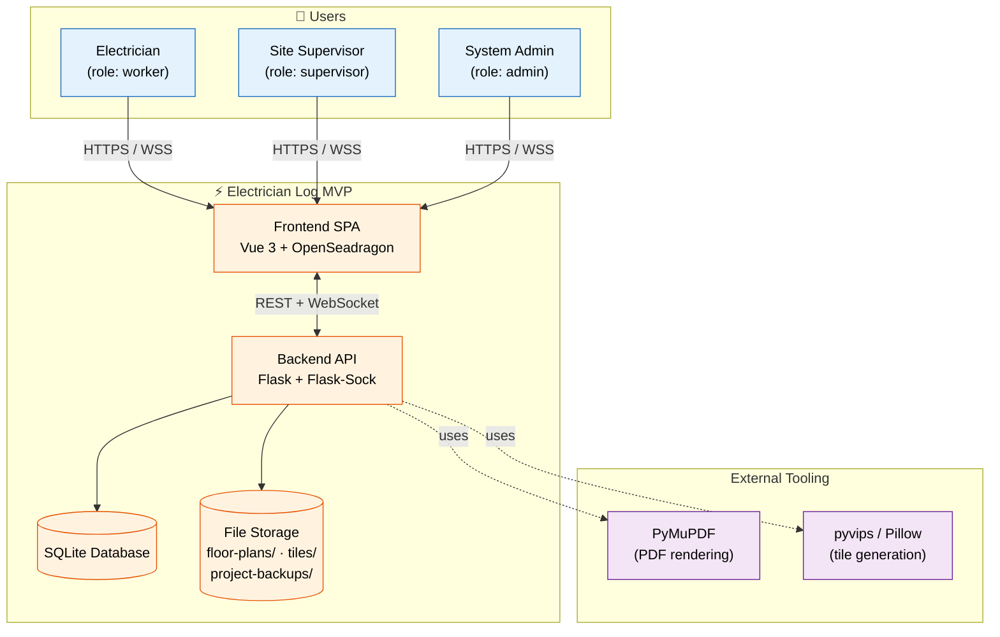

---

## 2. Container / Layered Architecture (C4 Level 2)

Internal containers, request paths, and persistence layers.

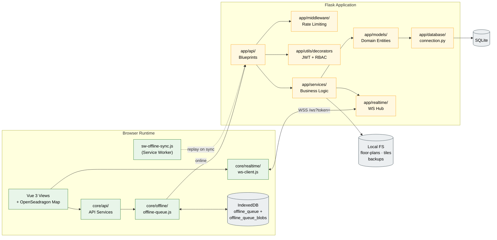

---

## 3. Backend Module Map

The Clean-Architecture style separation: **Routes → Services → Models → DB**.

```mermaid
graph TB
    subgraph API["app/api/ (HTTP Boundary)"]
        AAuth["auth/routes.py"]
        AProj["projects/routes.py"]
        AFloor["floors/routes.py"]
        AWL["work_logs/routes.py"]
        ACS["critical_sectors/routes.py"]
        AAsg["assignments/routes.py"]
        ATile["tiles/routes.py"]
        ADash["dashboard/routes.py"]
        ANotif["notifications/routes.py"]
    end

    subgraph SVC["app/services/ (Business Logic)"]
        SAuth["auth_service"]
        SProj["project_service"]
        SFloor["floor_service"]
        SWL["work_log_service"]
        SCS["critical_sector_service"]
        SAsg["assignment_service"]
        STile["tile_service"]
        SDash["dashboard_service"]
        SNotif["notification_service"]
        SBackup["project_backup_service"]
    end

    subgraph MOD["app/models/ (Entities)"]
        MUser["User"]
        MProject["Project"]
        MFloor["Floor"]
        MWL["WorkLog"]
        MCS["CriticalSector"]
        MAsg["Assignment"]
        MNotif["Notification"]
        MPUA["ProjectUserAssignment"]
        MCable["CableRoute"]
        MTpl["WorkTemplate"]
    end

    subgraph SUP["Supporting Layers"]
        RT["realtime/<br/>WebSocket Hub"]
        DEC["utils/decorators<br/>@token_required<br/>@role_required"]
        DB["database/connection.py<br/>migrations.py"]
        TG["utils/tile_generator_safe<br/>SafeTileGenerator"]
    end

    AAuth --> SAuth
    AProj --> SProj
    AFloor --> SFloor
    AWL --> SWL
    ACS --> SCS
    AAsg --> SAsg
    ATile --> STile
    ADash --> SDash
    ANotif --> SNotif

    SAuth --> MUser
    SProj --> MProject & SBackup
    SFloor --> MFloor
    SWL --> MWL & MCS
    SCS --> MCS
    SAsg --> MAsg & MWL
    SDash --> MWL & MAsg
    SNotif --> MNotif

    SWL -.broadcast.-> RT
    SAsg -.broadcast.-> RT
    SNotif -.broadcast.-> RT

    STile --> TG
    MUser & MProject & MFloor & MWL & MCS & MAsg & MNotif & MPUA & MCable & MTpl --> DB
    API --> DEC

    classDef api fill:#E1F5FE,stroke:#01579B,color:#000
    classDef svc fill:#FFF3E0,stroke:#E65100,color:#000
    classDef mod fill:#F1F8E9,stroke:#33691E,color:#000
    classDef sup fill:#FCE4EC,stroke:#880E4F,color:#000
    class AAuth,AProj,AFloor,AWL,ACS,AAsg,ATile,ADash,ANotif api
    class SAuth,SProj,SFloor,SWL,SCS,SAsg,STile,SDash,SNotif,SBackup svc
    class MUser,MProject,MFloor,MWL,MCS,MAsg,MNotif,MPUA,MCable,MTpl mod
    class RT,DEC,DB,TG sup
```

---

## 4. Frontend Module Map

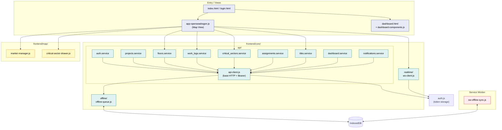

---

## 5. Domain Model (Entity-Relationship)

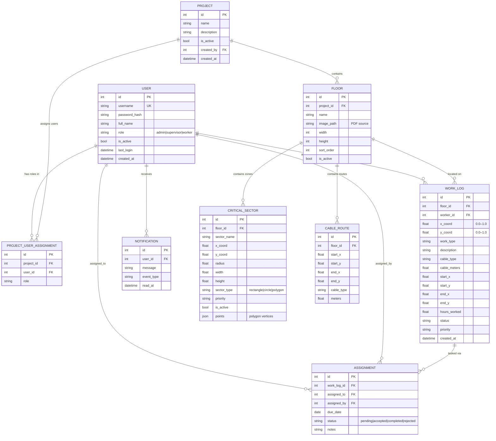

---

## 6. Authentication & Authorization Flow

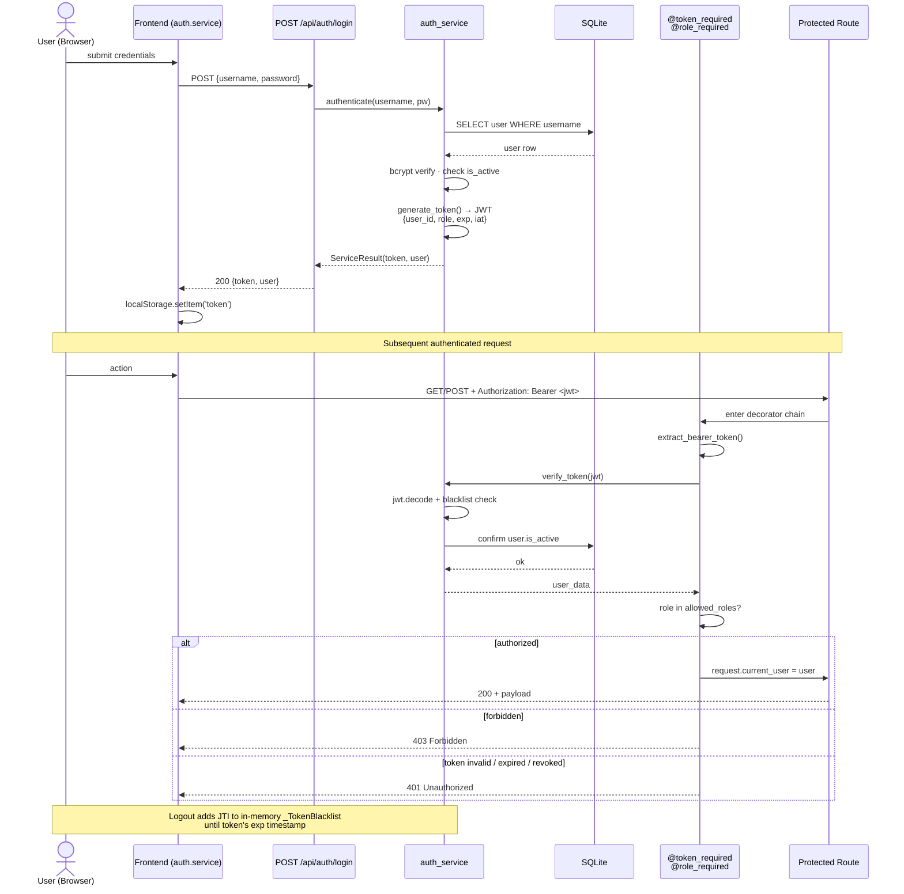

---

## 7. Realtime / WebSocket Hub

### 7a. Connection & Subscription

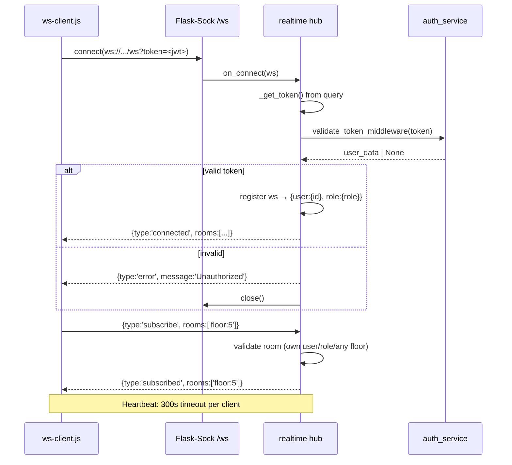

### 7b. Broadcast Pattern

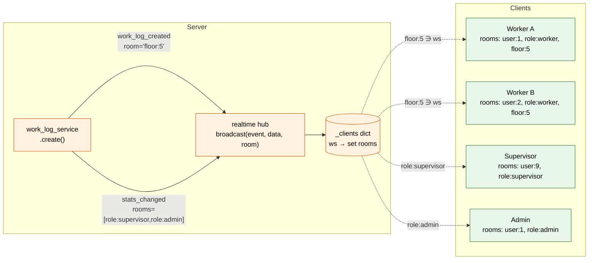

---

## 8. Offline-First Mutation Flow

### 8a. State Machine

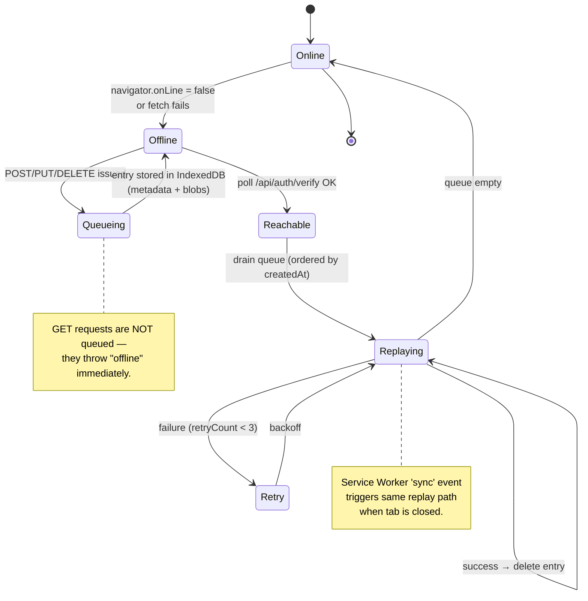

### 8b. Sequence — Offline POST + Replay

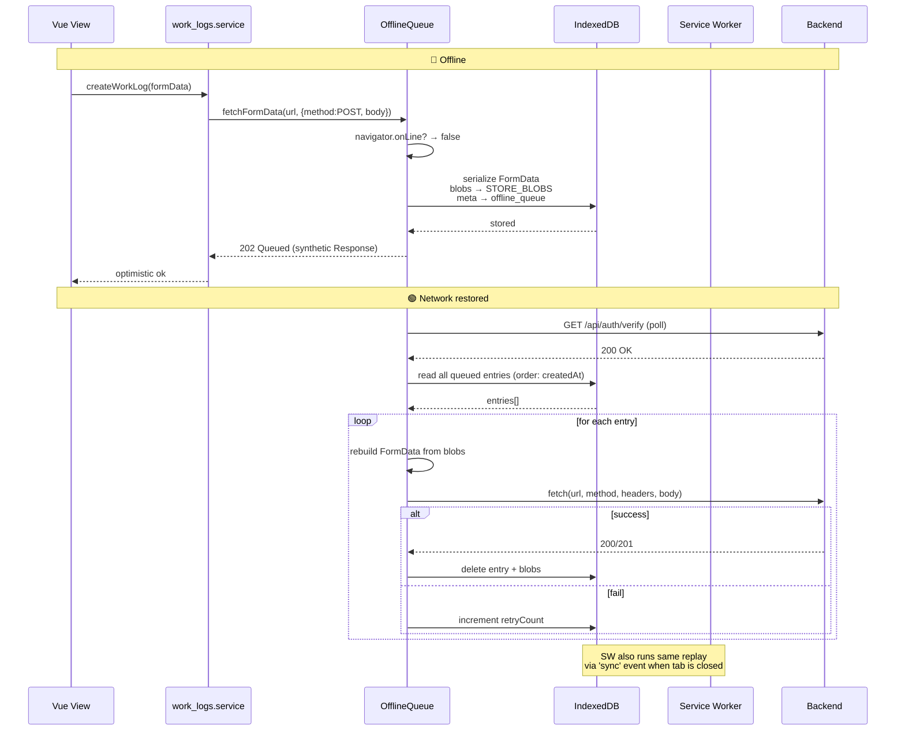

---

## 9. Image Tile Generation Pipeline

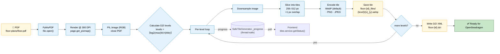

**Memory safeguards:** `Image.MAX_IMAGE_PIXELS = 500M`, eager `gc.collect()` per level, PDF closed immediately after rasterization.

---

## 10. End-to-End Request Lifecycle (Worker Creates a Work Log)

The integration of all subsystems for a single representative action.

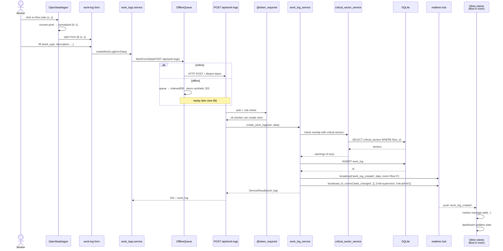

---

## 11. Deployment View

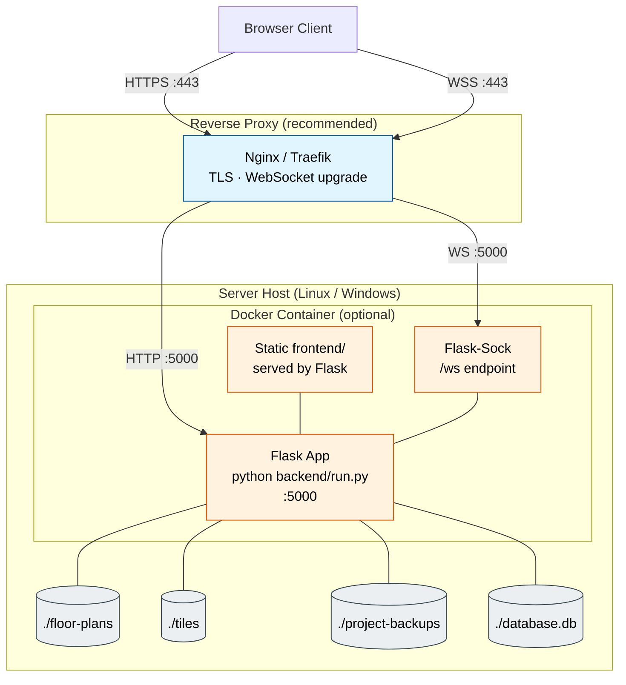

---

## 12. Cross-Cutting Concerns Summary

| Concern | Mechanism | Location |
|---|---|---|
| **AuthN** | JWT (HS256), `Authorization: Bearer` | `app/services/auth_service.py`, `app/utils/decorators.py` |
| **AuthZ** | Role decorators + resource-owner check | `@token_required`, `@role_required`, `@resource_owner_or_admin` |
| **Token revocation** | In-memory `_TokenBlacklist` until `exp` | `auth_service` |
| **Rate limiting** | Per-endpoint counters (memory or Redis) | `app/middleware/rate_limiting.py` |
| **Realtime** | Flask-Sock `/ws` + room registry | `app/realtime/__init__.py` |
| **Offline mutations** | IndexedDB queue + replay | `frontend/core/offline/offline-queue.js`, `sw-offline-sync.js` |
| **Spatial data** | Normalized (0..1) `x/y` coords on floors | `WorkLog`, `CriticalSector`, `CableRoute` |
| **Image pipeline** | PDF → PIL → DZI tiles (WebP) | `backend/utils/tile_generator_safe.py` |
| **Data safety** | ZIP backup before project delete | `project_backup_service.py` |
| **Migrations** | Idempotent schema creation on startup | `app/database/migrations.py` |
| **Service result** | `ServiceResult` dataclass for uniform API responses | `app/utils/result.py` |

---

## Reading Order Recommendation

For the architecture review, walk the diagrams in this order:

1. **§1 System Context** → who uses it, what's external.
2. **§2 Containers** → how the SPA, API, WS hub, and storage compose.
3. **§5 Domain Model** → the data shape that everything else operates on.
4. **§3 + §4 Module Maps** → backend and frontend internal structure.
5. **§6 Auth** → cross-cutting concern that gates everything.
6. **§7 Realtime** + **§8 Offline** → the two distinguishing capabilities.
7. **§9 Tile Pipeline** → the heaviest single subsystem.
8. **§10 End-to-End** → see all of the above cooperating in one flow.
9. **§11 Deployment** → ops view.
